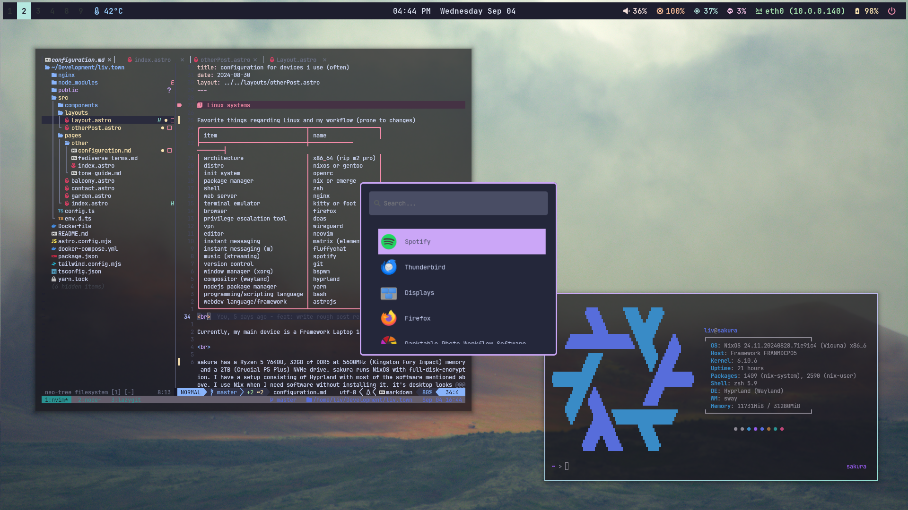

<h1 align="center">
    
   <br>
      Ahwxorg/NixOS-config
   <br>
       <br>
   <div align="center">

   <div align="center">
      <p></p>
      <div align="center">
         <a href="https://github.com/Ahwxorg/nixos-config/stargazers">
            
         </a>
         <a href="https://github.com/Ahwxorg/nixos-config/">
            
         </a>
         <a = href="https://nixos.org">
            
         </a>
         <a href="https://github.com/Ahwxorg/nixos-config/blob/main/LICENSE">
            
         </a>
      </div>
      <br>
   </div>
</h1>

### Gallery

<p align="center">
    <br>
   Screenshots last updated <b>2024-09-04</b>
</p>

# Overview

### Layout

- [flake.nix](flake.nix): base of the configuration
- [hosts](hosts): per-host configurations that contain machine specific configurations
  - [desktop](hosts/desktop/): Desktop specific configuration
  - [sakura](hosts/sakura/): Laptop (sakura) specific configuration
  - [violet](hosts/violet/): Server (sakura) specific configuration
- [modules](modules): modularized NixOS configurations
  - [core](modules/core/): core NixOS configuration
  - [homes](modules/home/): my [Home-Manager](https://github.com/nix-community/home-manager) config
  - [services](modules/services/): services ran on my servers
- [pkgs](flake/pkgs): packages exported by my flake
- [wallpapers](wallpapers/): wallpaper collection

### Components
|                             | NixOS + Hyprland                                                                              |
| --------------------------- | :---------------------------------------------------------------------------------------------:
| **Window Manager**          | [Hyprland][Hyprland] |
| **Bar**                     | [Waybar][waybar] |
| **Application Launcher**    | [wofi][wofi] |
| **Notification Daemon**     | [Mako][mako] |
| **Terminal Emulator**       | [Kitty][kitty] |
| **Shell**                   | [zsh][zsh] |
| **Text Editor**             | [Neovim][Neovim] + [VSCodium][VSCodium] |
| **network management tool** | [NetworkManager][NetworkManager] + [network-manager-applet][network-manager-applet] |
| **System resource monitor** | [htop][htop] |
| **File Manager**            | [thunar][thunar]
| **Fonts**                   | [nerd fonts][Nerd fonts] |
| **Color Scheme**            | [catppuccin][Catppuccin] |
| **Icons**                   | [catppuccin-papirus-folders][catppuccin-papirus-folders] |
| **Lockscreen**              | [hyprlock][hyprlock] |
| **Image Viewer**            | [nsxiv][nsxiv] |
| **Media Player**            | [mpv][mpv] |
| **Screenshot Software**     | [grimblast][grimblast] |
| **Clipboard**               | [wl-clip-persist][wl-clip-persist] |
| **Color Picker**            | [hyprpicker][hyprpicker] |


### Shell aliases

<details>
<summary>
NixOS (expand)
</summary>

> TODO: ${host} is either `desktop` or `laptop`

- ```cdnix```            $\rightarrow$ ```cd ~/nixos-config && codium ~/nixos-config```
- ```ns```               $\rightarrow$ ```nix-shell --run zsh```
- ```nix-switch```       $\rightarrow$ ```sudo nixos-rebuild switch --flake ~/nixos-config#${host}```
- ```nix-switchu```      $\rightarrow$ ```sudo nixos-rebuild switch --upgrade --flake ~/nixos-config#${host}```
- ```nix-flake-update``` $\rightarrow$ ```sudo nix flake update ~/nixos-config#```
- ```nix-clean```        $\rightarrow$ ```sudo nix-collect-garbage && sudo nix-collect-garbage -d && sudo rm /nix/var/nix/gcroots/auto/* && nix-collect-garbage && nix-collect-garbage -d```
</details>

### Scripts

All the scripts are in ```modules/home/scripts/scripts/``` and are exported as packages in ```modules/home/scripts/default.nix```

<details>
<summary>
toggle_blur.sh 
</summary>

**Description:** This script toggles the Hyprland blur effect. If the blur is currently enabled, it will be disabled, and if it's disabled, it will be turned on. 

**Usage:** ```toggle_blur```
</details>

<details>
<summary>
toggle_oppacity.sh 
</summary>

**Description:** This script toggles the Hyperland oppacity effect. If the oppacity is currently set to 0.90, it will be set to 1, and if it's set to 1, it will be set to 0.90. 

**Usage:** ```toggle_oppacity```
</details>

<details>
<summary>
runbg.sh 
</summary>

**Description:** This script runs a provided command along with its arguments and detaches it from the terminal. Handy for launching apps from the command line without blocking it. 

**Usage:** ```runbg <command> <arg1> <arg2> <...>```
</details>

# Installation 

> This is unchanged of Frost-Phoenix's dots, needs to be remade but don't feel like spending that time currently.

> **⚠️ Use this configuration at your own risk! ⚠️** <br>
> Applying custom configurations, especially those related to your operating system, can have unexpected consequences and may interfere with your system's normal behavior. While I have tested these configurations on my own setup, there is no guarantee that they will work flawlessly on all systems. <br>
> **I am not responsible for any issues that may arise from using this configuration.**

> It is highly recommended to review the configuration contents and make necessary modifications to customize it to your needs before attempting the installation.

1. **Install NixOS**

   First install nixos using any [graphical ISO image](https://nixos.org/download.html#nixos-iso). 
   > Only been tested using the Gnome graphical installer and choosing the ```No desktop``` option durring instalation.

2. **Clone the repo**

   ```
   nix-shell -p git
   git clone https://github.com/Frost-Phoenix/nixos-config
   cd nixos-config
   ```
3. **Install script**

   > First make sure to read the install script, it isn't long
   
   Execute and follow the installation script :
   ```
   ./install.sh
   ```
   > You will need to change the git account yourself in ./modules/home/git.nix
   ```
      programs.git = {
         ...
         userName = "Frost-Phoenix";
         userEmail = "67cyril6767@gmail.com";
         ...
      };
   ```
4. **Reboot**

   After rebooting, you'll be greeted by hyprlock prompting for your password, with its wallpaper in the background.

5. **Manual config**

   Even though I use home manager, there is still a little bit of manual configuration to do:
      - Set Aseprite theme (they are in the folder `./nixos-config/modules/home/aseprite/themes`).
      - Enable Discord theme (in Discord settings under VENCORD > Themes).
      - Configure the browser (for now, all browser configuration is done manually).

### Install script walkthrough

A brief walkthrough of what the install script does.

1. **Get username**

   You will receive a prompt to enter your username, with a confirmation check.

2. **Set username**

   The script will replace all occurancies of the default usename ```CURRENT_USERNAME``` by the given one stored in ```$username```

3. Create basic directories

   The following directories will be created:
   - ```~/Music```
   - ```~/Documents```
   - ```~/Pictures/wallpapers/others```

4. Copy the wallpapers

   Then the wallpapers will be copied into ```~/Pictures/wallpapers/others``` which is the folder in which the ```wallpaper-picker.sh``` script will be looking for them.

5. Get the hardware configuration

   It will also automatically copy the hardware configuration from ```/etc/nixos/hardware-configuration.nix``` to ```./hosts/nixos/hardware-configuration.nix``` so that the hardware configuration used is yours and not the default one.

6. Choose a host (desktop / laptop)

   Now you will need to choose the host you want. It depend on whether you are using a desktop or laptop.

7. Build the system

   Lastly, it will build the system, which includes both the flake config and home-manager config.

# 👥 Credits

Other dotfiles that I learned / copy from:

- [Frost-Phoenix/nixos-config](https://github.com/Frost-Phoenix/nixos-config): This is the repository that I cloned and changed to my needs. Their credits are in their repository's readme.
- [notthebee/nix-config](https://github.com/notthebee/nix-config)
- [Ruixi-rebirth/melted-flakes](https://github.com/Ruixi-rebirth/melted-flakes): Waybar configuration mostly
- [mrusme/dotfiles](https://github.com/mrusme/dotfiles)

<!-- Links -->
[Hyprland]: https://github.com/hyprwm/Hyprland
[Kitty]: https://github.com/kovidgoyal/kitty
[Waybar]: https://github.com/Alexays/Waybar
[wofi]: https://hg.sr.ht/~scoopta/wofi
[zsh]: https://ohmyz.sh/
[hyprlock]: https://github.com/hyprwm/Hyprlock
[mpv]: https://github.com/mpv-player/mpv
[VSCodium]:https://vscodium.com/
[Neovim]: https://github.com/neovim/neovim
[grimblast]: https://github.com/hyprwm/contrib
[htop]: https://github.com/htop-dev/htop
[thunar]: https://docs.xfce.org/xfce/thunar/start
[nsxiv]: https://nsxiv.codeberg.page
[mako]: https://github.com/emersion/mako
[nerd fonts]: https://github.com/ryanoasis/nerd-fonts
[NetworkManager]: https://wiki.gnome.org/Projects/NetworkManager
[network-manager-applet]: https://gitlab.gnome.org/GNOME/network-manager-applet/
[wl-clip-persist]: https://github.com/Linus789/wl-clip-persist
[hyprpicker]: https://github.com/hyprwm/hyprpicker
[catppuccin]: https://github.com/catppuccin/catppuccin
[catppuccin-papirus-folders]: https://github.com/catppuccin/papirus-folders
